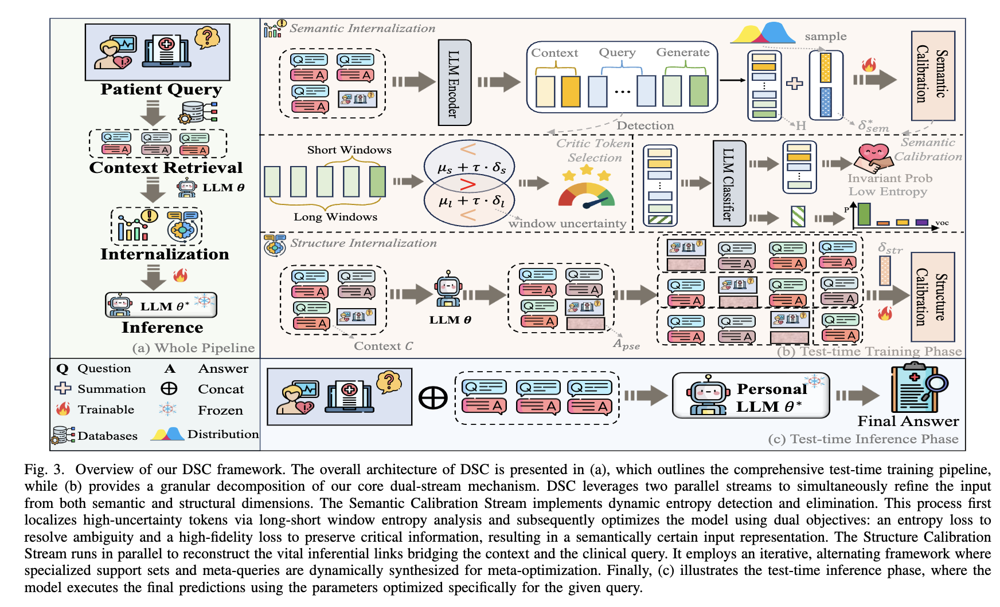
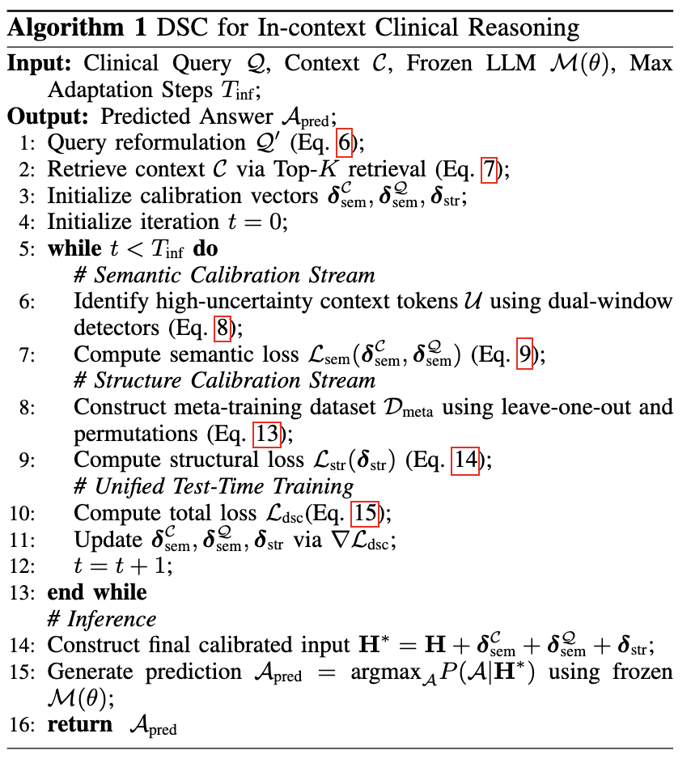

<h1 align="center"> From Exposure to Internalization: Dual-Stream Calibration for In-context Clinical Reasoning </h1>


## About Our Work

Update: 2026/05/12: We have created a repository for the paper titled *From Exposure to Internalization: Dual-Stream Calibration for In-context Clinical Reasoning*, which has been submitted to the ==*TPAMI 2026*==. In this repository, we offer the preprocessing scripts and algorithm files to showcase the reproducibility of our work.





## Requirements

- langchain==1.1.3
- torch==2.8.0+cu128
- faiss==1.8.0
- flash_attn==2.8.3

## Data Sets

Owing to the copyright stipulations associated with the dataset, we are unable to provide direct upload access. However, it can be readily obtained by downloading directly from the official website: [ExaminationQA (Hard)](https://github.com/stanfordmlgroup/MedAgentBench), [Laysummarization](https://github.com/yhzhu99/MedAgentBoard/tree/main), [Clinical Diagnosis](https://huggingface.co/datasets).

The structure of the data set should be like,

```powershell
datas
|_ MedQA-collections
|  |_ medqa
|  |_ _ train_dataset_MCQ.pkl
|  |_ _ test_dataset_MCQ.pkl
|  |_ mmlu
|  |_ _ train_dataset_MCQ.pkl
|  |_ _ test_dataset_MCQ.pkl
|_ MediQ
|  |_ train_dataset_MCQ.pkl
|  |_ test_dataset_MCQ.pkl
|  |_ train_dataset_FREE.pkl
|  |_ test_dataset_FREE.pkl
```

## RUN

```powershell
# stage 0: env
conda activate ttl
export RAY_memory_monitor_refresh_ms=0 
export PYTHONIOENCODING=utf-8
export PYTHONUTF8=1
export LANG=en_US.UTF-8
export LC_ALL=en_US.UTF-8
module load cuda/12.8

# stage 1: dataset generation
## change config.py [TOPK=10] to generate sufficient context. (just for convinience in the future)
python main.py

# stage 2: change config.py [TOPK=3] to match the settings in the paper.
python3 main.py --use_entropy_control --adaptive_entropy --do_sample  > ours-medqa.log
```

## Paper Link & Bib

We will update after acceptance.

## Acknowledge & Contact

You could contact czhaobo@connect.ust.hk if you have any problems. If you want to make several collaboration in the healthcare fields, please do not hesitate to send an email to him.

